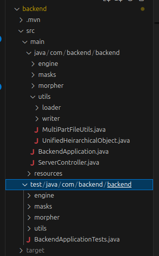
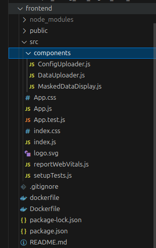
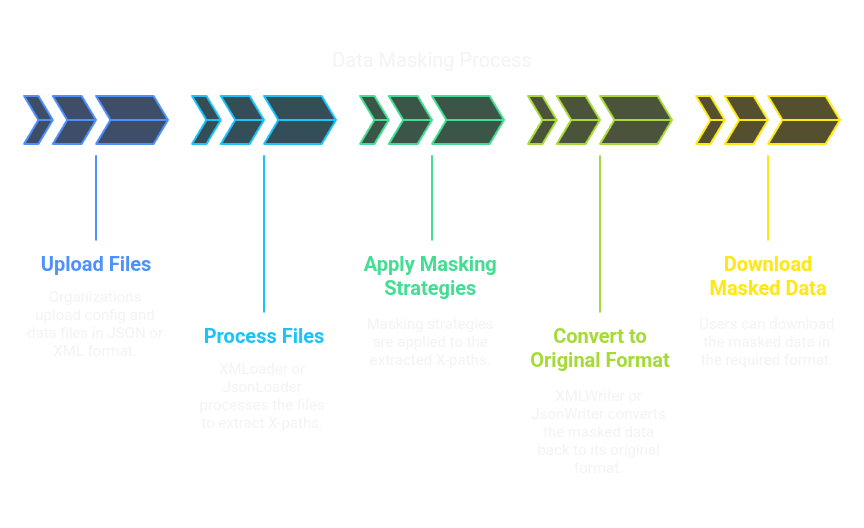
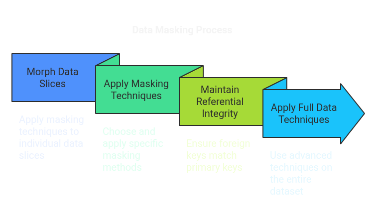

# Data Modelling Project
1. Keshav Chandak(IMT2021003)
2. Krutik Patle(IMT2021024)
3. Ricky Ratnani(IMT2021030)

## Introduction

In recent times, AI poses a huge threat for data exposure to big corporations. And if there are any security vulnerabilites in those systems, these sensitive data might fall into wrong hands. Thus, the data should be protected from outside views. Thus, the concept of data masking arises. Now, we see that most of the data around us is semi-structured or un-structured, thus the implementation with respect to current scenario takes greater precedence.

Here, we have considered XML and Json data, where the config files will be provided by the cybersecurity organisations, and the data files that is uploaded by users is morphed before getting received by third-party companies.

We explain the code along with the structure in great details below. 

## Backend Directory Structure

   

The components as shown in the above image is explained below:

- **`src/main/java/com/backend/backend`**  
  - `engine/`  
    - Core business-logic components  
  - `masks/`  
    - Privacy-masking strategies (K-Anonymity, L-Diversity, T-Closeness)  
  - `morpher/`  
    - Data-transformation utilities (Morpher, Full Data, Referential Integrity)
  - `utils/loader/`  
    - Input-parsing helpers (XML/JSON readers)  
  - `utils/writer/`  
    - Output-serialization helpers (e.g. `XMLWriter`)  
  - `MultiPartFileUtils.java`  
    - File-upload utility methods  
  - `UnifiedHeirarchicalObject.java`  
    - Tree-structured data model  
  - `BackendApplication.java`  
    - Spring Boot application entry point  
  - `ServerController.java`  
    - REST API endpoints  

- **`src/test/java/com/backend/backend`**  
  - Unit/integration tests mirroring the above packages  

## Frontend Directory Structure

   

The components as shown in the above image is explained below:

- **`src/components/`**  
  - `ConfigUploader.js` — handles uploading of configuration files  
  - `DataUploader.js` — handles uploading of data files  
  - `MaskedDataDisplay.js` — displays the masked/output data  

- **`src/`**  
  - `App.js` — root React component  
  - `App.css` — global styles for the app  
  - `App.test.js` — tests for `App.js`  
  - `index.js` — application entry point (renders `<App />`)  
  - `index.css` — base/reset CSS  
  - `logo.svg` — application logo asset  
  - `reportWebVitals.js` — performance metrics logger  
  - `setupTests.js` — Jest setup for unit tests  

- **Project Root**  
  - `.gitignore` — files to ignore in Git  
  - `dockerfile` — Docker build instructions  
  - `package.json` & `package-lock.json` — dependencies and scripts  
  - `README.md` — project overview and instructions regarding frontend.

## Steps to run API and commnad line tool inside ./backend/:

1. `mvn clean package` - This will create the jar file in the target directory (java jar snapshot)
2. `To run as a webserver` : JAVA -jar jar_file_name.jar
3. `To run as a command line tool` : java -jar jar_file_name.jar --data path/to/data/file --config path/to/config/file --out path/for/masked/output/file

## Steps to run interactive full-stack code:

1. Open backend folder in terminal.
2. Run `mvn clean install`. This will install the dependanice in the pom.xml and run all the tests mentioned in the `src/test/java/com/backend/backend` directory.
3. Run `mvn spring-boot:run` on the terminal, which starts the backend service.
4. Open frontend folder on the second terminal.
5. Run `npm install` to install all the dependancies.
6. Run `npm start` to start the frontend service.
7. You will now be able to run the code on `http://localhost:3000` . Now, we can try masking with config and data files.

## High-Level Overview of Backend Directory:

We have utilised Java backend(maven), due to simplicity and easier implementation of design patterns, as compared to javascript backend tech-stacks due to it's object-oriented nature. 

### 1. **DataLoader**    
- **Purpose**: Responsible for parsing and loading input data files (XML or JSON) into memory.
- **How it works**:
  - Reads the input file based on its format (XML or JSON).
  - Uses format-specific loaders (`XMLLoader` or `JSONLoader`) to parse the data.
  - Converts the parsed data into a unified internal representation for further processing.
- **Design Pattern**: Factory Pattern
  - The `DataLoaderFactory` determines the appropriate loader (`XMLLoader` or `JSONLoader`) based on the file type.

### 2. **XMLLoader**
- **Purpose**: Handles the parsing of XML data files.
- **How it works**:
  - Uses an XML parser (e.g., `javax.xml.parsers.DocumentBuilder`) to read and parse the XML file.
  - Extracts data nodes based on the configuration file's XPath expressions.
  - Maps the extracted data into a structured format for processing.
- **Key Features**:
  - Supports complex XPath queries to locate specific fields.
  - Handles nested and hierarchical XML structures.
- Similarly, JsonLoader handles the json data files.

### 3. **DataWriter**
- **Purpose**: Writes the processed (masked) data back to an output file in the desired format (XML or JSON).
- **How it works**:
  - Accepts the processed data and the desired output format.
  - Uses format-specific writers (`XMLWriter` or `JSONWriter`) to generate the output file.
- **Design Pattern**: Factory Pattern
  - The `DataWriterFactory` determines the appropriate writer (`XMLWriter` or `JSONWriter`) based on the output format.

### 4. **XMLWriter**
- **Purpose**: Handles the generation of XML output files.
- **How it works**:
  - Constructs an XML document using the processed data.
  - Ensures that the output adheres to the original structure while incorporating the masked values.
  - Writes the XML document to the specified output file.

### 5. **Morphers**
- **Purpose**: Apply masking strategies to the data fields as defined in the configuration file.
- **How it works**:
  - Each masking strategy (e.g., `HASH`, `REDACT`, `RANGESHIFT`) is implemented as a separate class.
  - The `MorpherFactory` selects the appropriate morpher based on the configuration.
  - Morphers are applied to the data fields during processing.
- **Design Pattern**: Strategy Pattern
  - Each masking strategy is encapsulated in its own class, allowing for easy addition of new strategies.

## Detailed Overview of Backend Directory:

### Workflow

1. **Input Files**:
   - **Configuration File**: Defines the fields to be masked, their masking strategies, and dependencies.
   - **Data File**: Contains the raw data to be masked (XML or JSON).

2. **Process Files**:
   - The `DataLoader` reads the data file and converts it into an internal representation.
   - The `XMLLoader` or `JSONLoader` is used based on the file format.

3. **Masking**:
   - The masking engine iterates over the data fields.
   - For each field, the appropriate `Morpher` is applied based on the configuration.

4. **Writing**:
   - The `DataWriter` generates the output file in the desired format.
   - The `XMLWriter` or `JSONWriter` is used based on the output format.

### Design Patterns Used

1. **Factory Pattern**:
   - Used for creating loaders (`XMLLoader`, `JSONLoader`) and writers (`XMLWriter`, `JSONWriter`).
   - Centralizes the logic for determining the appropriate class to use based on file format.

2. **Strategy Pattern**:
   - Used for implementing masking strategies (`HASH`, `REDACT`, `RANGESHIFT`, etc.).
   - Encapsulates each strategy in its own class, making it easy to add or modify strategies.

3. **Template Method Pattern**:
   - Used in loaders and writers to define the skeleton of the loading/writing process.
   - Allows subclasses to implement specific steps (e.g., parsing XML vs. JSON).

### Example Flow

1. **XMLLoader** reads an XML file and extracts data nodes based on XPath expressions.
2. The `MorpherFactory` selects the appropriate masking strategy for each field.
3. The selected `Morpher` (e.g., `HASH`) processes the field value and applies the transformation.
4. The `XMLWriter` constructs the output XML file with the masked values and writes it to disk.

### Morphing Methods

The backend supports a variety of morphing methods to anonymize sensitive data while preserving its utility. Each morphing method is implemented as a separate class in the `masks` folder, adhering to the **Strategy Pattern** for flexibility and extensibility. Below are the details of each morphing method:

#### NONE
- **What it does**: Leaves data completely unchanged.
- **Why**: The `NONE` masking directly returns the input value without any transformation. It is done in case of non-relevant data, which needs not need hiding, or for foreign key-dependancy.

#### HASH
- **What it does**: Applies a one-way cryptographic hash to the input value.
- **Why**:  
  - The `HASH` class uses cryptographic libraries (e.g., `java.security.MessageDigest`) to generate a hash.
  - In our case, due to simplicity, we have passed parameter `SHA256`, but it can be easily extended by changing the `HashMaskingStrategy.java` file.
  - It is used in pseudonymization of IDs, names, or any value that doesn’t need to be reversible.

#### RANGESHIFT
- **What it does**: Adds a random offset to numeric values within a specified range.
- **Why**:  
  - The `RANGESHIFT` class generates a random shift between -10% and +10%.
  - We can optionally create a seed to make it non-randomised, and also pass shift ranges in the parameters. 
  - it is used in fields like salaries, ages, or other continuous numeric data.

#### SUBSTITUTION
- **What it does**: Replaces the original value with an entry which has last four values switched to XXXX. 
- **Why**: It is used in masking credit card numbers, phone numbers, or categorical fields, by specific numbers to maintain consistency.

#### REDACT
- **What it does**: Replaces the value with a fixed placeholder "REDACT".
- **Why**:  
  - The `REDACT` replaces the input value with a `placeholder` (i.e., `"REDACTED"`).
  - Free-form text fields, addresses, or sensitive notes.

#### EMAIL
- **What it does**: Masks parts of an email address.
- **Implementation**:  
  - The `EmailMorpher` class splits the email into local-part and domain.
  - Masks the local-part and/or domain based on `maskLocal` and `maskDomain` parameters.
  - Optionally uses a `placeholder` for masked portions.
- **Use cases**: User emails for display in reports or UI previews.

#### PARTIAL_MASKING
- **What it does**: Masks all but a variable number of characters at the start of a string.
- **Why**: The `PARTIALMASKING` masks a specified number of characters (`X`) at the `prefix`, and keeps the rest of them same. This is different from SUBSTITUTION method, as it arbitrarily masks at the prefix instead of suffix, and takes parameters which makes it utilisable for various purposes.

#### RANDOMIZATION
- **What it does**: Adds random k digits or characters from k length string.
- **Why**:  This is implemented for non-deterministic morphing, for extremely sensitive data, without any seed such that there is no reversibility even by the administrator.

#### BINNING
- **What it does**: Groups numeric values into bins of fixed width.
- **Why**:  
  - The `BINNING` strategy calculates bins based on the `x` parameter (bin-width exponent). This is useful for age groupings, income brackets, or coarsening continuous variables.

#### NOISE_INJECTION
- **What it does**: Perturbs values by adding random noise from a specified character distribution to changed character mapping. 
- **Why**:  The `NOISEINJECTION` generates noise by swapping certain characters with others. This can be defined based on company requirements. It is used when masking exact names, so it cannot be used directly for searches on social medias, etc.

#### K‑ANONYMIZATION
- **What it does**: Ensures each quasi-identifier combination appears in at least `k` records.
- **Implementation**:  
  - The `KAnonymizationMorpher` suppresses or generalizes quasi-identifier values to meet the `k` threshold.
  - Here, we are considering the full data, while morphing the records.
  - Uses a suppression marker (default `"*"`) for unique values.
- **Use cases**: Demographic data requiring group anonymity.

#### L‑DIVERSITY
- **What it does**: Ensures each equivalence class(quasi-identifeirs) has at least `l` distinct sensitive values.
- **Implementation**:  
  - The `LDiversityMorpher` enforces diversity within equivalence classes by generalizing or suppressing values.
  - This helps in hiding sensitive attribute on group of data, thus, completely making the masked data irreversible.
  - Uses a suppression marker (default `"*"`) for sensitive attributes which are not L-diverse.
- **Use cases**: Health or financial data where sensitive attribute disclosure must be prevented.

#### T‑CLOSENESS
- **What it does**: Limits the distance between sensitive attribute distributions in groups and the global distribution.
- **Implementation**:  
  - The `TClosenessMorpher` calculates the distance (e.g., Earth Mover’s Distance) and adjusts values to meet the `t` threshold.
  - Uses a suppression marker (default `"*"`) for sensitive attributes which are not T-close.
- **Use cases**: Protecting skewed sensitive attributes in datasets.

### Current Assumptions

The current implementation is based on the following assumptions:

1. There are no loops in the foreign key dependency graph.
   - The masking logic performs a DFS traversal for referential integrity.  
   - Cycles in the graph could lead to infinite recursion, which is not currently handled.

2. The config and data files are homogenous to the nature expected, as highlighted by the sample config and data files.

3. The K-Anonymisation, L-Diversity and T-Closeness methods are applied after all masking, and foriegn key dependancies are handled.

## Brief Logic for added Referential Integrity Constraint

### Main Steps in Implementation

1. **Maintain a `primaryKeyPath -> [foreignKeyPaths]` map**
   - This map captures the referential dependency tree. When a primary key is masked, all foreign keys that refer to it must also be updated to preserve consistency.

2. **Parse the `<refersTo>` tag** from the configuration
   - While loading the config, each field is checked for a `<refersTo>` tag to build the map from Step 1 dynamically.

3. **Recursive masking using DFS traversal**
   - When a masking operation is performed on a primary key, a depth-first traversal is triggered on all related foreign key paths, ensuring that the same transformation is applied recursively.

### Supporting Structures Added

#### 1. `foreignKeyMap` - Creaetd and Populated in ConfigLoader.java
- **Type**: `Map<String, List<String>>`
- Stores a list of foreign key XPaths for each primary key XPath.
- Enables recursive masking of dependent fields.

#### 2. `xPathValueToDataMap` - Created and Populated the first in DataLoader.java
- **Type**: `Map<String, Map<String, List<UnifiedHeirarchicalObject>>>`
- Used to locate data nodes by both XPath and their value.
- Crucial for identifying which fields to mask.
- After masking, this map needs to be updated using the transformation log to reflect the new values.

#### 3. `valueTransformationLog`  - Created and Maintained in ReferentialMaskingExecutor.java
- **Type**: `Map<String, String>`
- Keeps track of how original values are transformed during masking.
- Used to propagate changes across foreign key dependencies.
  
#### 4. Live remapping of `xPathValueToDataMap`
- After each masking operation, a helper method applies the `valueTransformationLog` to update the value → node mapping.
- This ensures that subsequent masking operations (especially on foreign key fields) continue to work correctly with the new values.

### Example Flow

1. A masking strategy is applied to a primary key field.
2. All nodes with a given `(xPath, value)` are retrieved using `xPathValueToDataMap`.
3. The value is transformed and recorded in `valueTransformationLog`.
4. The map `xPathValueToDataMap` is updated to reflect the new value.
5. All foreign key paths referring to the primary key are recursively masked using the same transformation logic.
6. This process continues in a depth-first manner across all dependencies.

